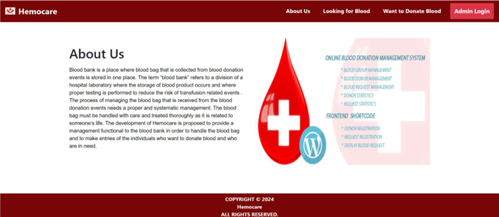

# Hemocare: Efficient Blood Bank and Donation Management System 🩸💉

**Hemocare** is a comprehensive, **PHP-based web application** designed to streamline the management of **blood donations** and **blood bank** operations. This system is equipped with both **user** and **admin** interfaces, making it easier to manage **donor registrations, blood requests, and donor information**.

**Key Features of Hemocare**
1. **Donor Registration**
Easily register as a blood donor through a simple and intuitive donor registration form.
2. **Blood Donation Requests**
Search for blood donors based on blood group and availability using a dedicated blood request feature.
3. **Admin Dashboard**
Admins can manage donor records, track blood donations, update website content, and respond to user queries efficiently.
4. **Secure Database**
Utilizes a MySQL database to securely store donor data, blood group information, and donation history.
5. **Responsive Design**
The application is designed to be mobile-friendly and provides a user-friendly experience for both donors and administrators.

**Why Choose Hemocare for Blood Bank Management?**

Hemocare simplifies the entire process of blood donation management, improving donor engagement and enabling hospitals and clinics to access vital blood supply data more efficiently. Whether you're a blood donor or a healthcare professional, Hemocare ensures that the donation process is seamless, transparent, and efficient.

**Technologies Used**

**PHP:** The core technology powering the backend of the application.

**MySQL:** Securely manages donor information, blood requests, and donation records.

**HTML/CSS:** Ensures responsive and accessible front-end design.

**JavaScript:** Enhances the user experience with interactive features.

## **Screenshots** 📸

### User Panel:
#### Home Page 🏠:


#### Basic Information 📝:


#### About Us 📖:


#### Need Blood 🔍:


#### Donor Registration 📝:


#### Donor Info Card 🏷️:


#### Contact Us 📞:


### Admin Panel:
#### Admin Login 🔑:


#### Admin Dashboard 📊:


#### Change Password 🔐:


#### Donor List 🗂️:


#### User Query 📨:


#### Manage Pages 🛠️:


---

## **Installation** 🔧

### Prerequisites:
- **XAMPP** or **WAMP** installed.
- A browser for accessing the application.

### Steps:
1. Clone this repository:
   ```bash
   git clone https://github.com/PulkitAgrawal23/Hemocare.git
   ```

2. Navigate to the project folder:
   ```bash
   cd Hemocare
   ```

3. Set up the environment:
   - **For XAMPP**: Move the `Hemocare` folder to the `htdocs` directory in your XAMPP installation folder. You can access the application through `(http://localhost/hemocare-main)` after starting the XAMPP server.
   - **For WAMP**: Move the `Hemocare` folder to the `www` directory in your WAMP installation folder. You can access the application through `(http://localhost/hemocare-main)` after starting the WAMP server.

4. Set up the database:
   - Open **phpMyAdmin** through your browser (typically at `http://localhost/phpmyadmin`).
   - Create a new database named `hemocare`.
   - Import the `blood_bank_database.sql` file (provided in the repository) to set up the necessary tables and data.

5. Configuration:
   - Open the `config.php` file in the project directory.
   - Update the database connection settings with your database credentials (e.g., username, password, and database name).

6. Access the application:
   - Open a browser and go to `http://localhost/hemocare-main` to use the system.

---

## **Usage** 📖

### User Panel:
- **Donate Blood** 🩸: Users can register as donors by filling out the donation form. After registration, donors are added to the donor list.
- **Need Blood** 🔍: Users can search for blood donors based on blood group and availability.
- **Contact Us** 📞: Users can contact administrators for support or inquiries.

### Admin Panel:
- **Admin Login** 🔑: Admins can log in to the system with credentials to access the admin dashboard.
- **Dashboard** 📊: Admins can view the total number of donations, donor details, and recent user activity.
- **Manage Donors** 🗂️: Admins can view, add, edit, or delete donor records.
- **Manage Pages** 🛠️: Admins can update static pages like About Us, Contact Us, etc.
- **User Queries** 📬: Admins can manage and respond to user queries submitted through the website.

---

## **Contributing** 🤝

We welcome contributions to **Hemocare**! If you have suggestions, improvements, or bug fixes, feel free to fork the repository and create a pull request.

### How to Contribute:
1. Fork the repository on GitHub.
2. Clone your fork to your local machine:
   ```bash
   git clone https://github.com/yourusername/Hemocare.git
   ```
3. Create a new branch for your changes:
   ```bash
   git checkout -b feature/your-feature-name
   ```
4. Make your changes and commit them:
   ```bash
   git add .
   git commit -m "Description of changes"
   ```
5. Push to your fork:
   ```bash
   git push origin feature/your-feature-name
   ```
6. Open a pull request from your fork to the original repository.

---

## **License** 🔒

This project is licensed under the MIT License - see the [LICENSE](LICENSE) file for details.

---


### Additional Notes:
- Make sure the `blood_bank_database.sql` file is included in your repository (if it's not already) for setting up the database.
- If there are any other specific instructions you'd like to add, feel free to modify the above sections.


### SEO Keywords Integrated:
## Blood bank management system
## PHP blood donation platform
## Donor registration system
## Blood donation request platform
## Admin dashboard for blood bank
## Blood donation management software
## MySQL blood bank database
## Blood donation app
